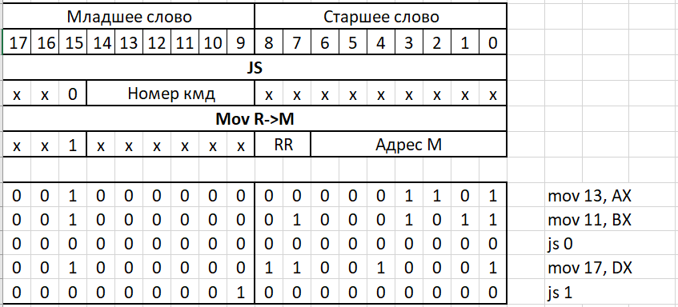

<<<<<<< HEAD:5 семестр/СиФОВМ/README.md
## Варианты лабораторных

- lab1 Схема - Мультиплексор,	Дополнение - синхронный,	Разрядность 8 в 1 - утеряна
- lab2 Форма сигнала clk_in -a,	m - 9,	n - 5,	Делитель частоты D - 10
- lab3 Размер ША (бит) - 8,	ROM вывод	- синхр, RAM вывод - синхр,	Размер буфера (N байт) - 6,	Задержка (тактов) - 4
- lab4 ША	ШД	команда 1	адресация операнда-источника 1ком.	команда 2	адресация 2ком.

=======
## Варианты лабораторных

- lab1 Схема - Мультиплексор,	Дополнение - синхронный,	Разрядность 8 в 1 - утеряна
- lab2 Форма сигнала clk_in -a,	m - 9,	n - 5,	Делитель частоты D - 10
- lab3 Размер ША (бит) - 8,	ROM вывод	- синхр, RAM вывод - синхр,	Размер буфера (N байт) - 6,	Задержка (тактов) - 4
- lab4 ША	ШД	команда 1	адресация операнда-источника 1ком.	команда 2	адресация 2ком.

### АСК для 4й лабораторной

>>>>>>> 48ba9abe725f093589714d549a3bc424c54415d0:5 term/СиФОВМ/README.md
